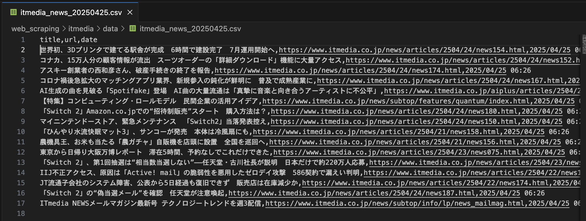
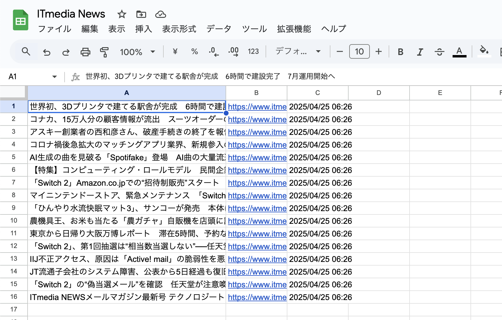

# 📡 ITmedia ニューススクレイピング＆Googleスプレッドシート連携スクリプト

## 📘 概要

ITmediaのニュースサイトから記事（タイトル・URL・公開日時）をスクレイピングし、CSVファイルに保存＆Googleスプレッドシートに自動記録するPythonスクリプトです。

- 重複記事は自動排除
- 毎日のニュースログとしても活用可能
- スプレッドシート連携済み

---

## ✨ 使用方法

### 1. 必要ライブラリのインストール

```bash
pip install -r requirements.txt
```

### 2. Google Cloudサービスアカウントの設定

#### ✅ サービスアカウントの作成

1. [Google Cloud Console](https://console.cloud.google.com/) にアクセス
2. プロジェクトを作成または選択
3. 左メニュー →「APIとサービス」→「認証情報」
4. 「認証情報を作成」→「サービスアカウント」
5. 任意の名前で作成（例：python-scraper）
6. 「鍵」タブ →「鍵を追加」→「JSON」形式でダウンロード

✅ このファイルをルートに `credentials.json` として保存

#### ✅ スプレッドシート側の設定

1. 対象のスプレッドシートを開く
2. 右上「共有」→ ダウンロードしたサービスアカウントのメールアドレスを追加し「編集者」に設定

---

## 🏃‍♂️ 実行コマンド

```bash
python3 main.py
```

---

## 🧹 ファイル構成と役割

### `main.py`

- 処理のエントリーポイント
- 記事取得・重複除外・CSV保存・スプレッドシート送信の一連の流れを実行

### `scraper.py`

- ITmediaのトップページから記事を取得
- タイトル、URL、公開日（例：4月24日 18時00分）を抽出

### `spreadsheet.py`

- Googleスプレッドシートに記事を1件ずつ書き込む
- `gspread`とサービスアカウントでOAuth認証

---

## 🔄 main.py 実行フロー図

```mermaid
graph TD
    main_py["main.py 実行"] --> get_articles["articles = scrape_itmedia_news()"]
    get_articles -->|scrape_itmedia_news() 呼び出し| scraper["scraper.py 実行"]
    scraper --> collect["記事一覧を取得しリストに格納"]
    get_articles --> get_existing["get_existing_titles_and_urls()"]
    get_existing --> read_csv["既存CSVからタイトル・URLのセットを作成"]
    get_articles --> dedup["remove_duplicates()"]
    dedup --> filter["重複しない記事のみを抽出"]
    filter --> save_csv["pandas.DataFrame に変換してCSV保存"]
    save_csv --> spreadsheet["write_to_spreadsheet()"]
    spreadsheet --> write_gsheet["Google Spreadsheet に書き込み"]
```

---

## 📂 出力例

- `data/itmedia_news_YYYYMMDD.csv`

- Googleスプレッドシートに1行ずつ追加


---

## 🛡️ セキュリティと注意点

- `credentials.json` は**絶対にGitにコミットしないこと！**
- `.gitignore` に以下を追加：
  ```gitignore
  credentials.json
  *.json
  ```

---

## 👨‍💼 作者

Ryoma Ueda  
ポートフォリオ・学習ログとしてGitHubで公開中  
（副業・自動化・Pythonツール開発に興味あり）

---

